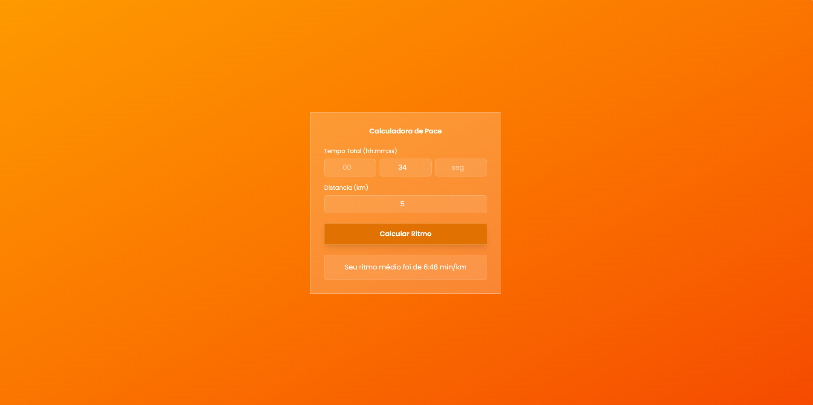

# Calculadora de Pace
  Projeto responsivo de uma calculadora de pace (Ritmo) usada por corredores em suas atividades, desenvolvido com HTML5, JavaScript puro e Tailwind. Ao passar as entradas de hora, minuto, segundo e a distância percorrida, o cálculo é realizado e assim gerado o seu ritmo.

🚀 Funcionalidades:

  Interface Glassmorphism: Design moderno utilizando efeitos de transparência e desfoque.

  Responsividade: Interface adaptável para diferentes tamanhos de tela.

🛠️ Tecnologias Utilizadas:

  HTML5: Estruturação semântica do projeto.

  JavaScript (ES6+): Lógica de programação envolvendo a transformação dos valores de entrada para segundos, facilitando o cálculo e transformando novamente em mm:ss formato padrão usado pelos corredores para visualizaçã do pace(ritmo).

  Tailwind: Framework CSS usado para aplicar o efeito de glassmorphism, ultilizando-se de classes utilitárias pré-definidas para estilizar elementos diretamente no HTML.

  📝 Estudo:

  Projeto desenvolvido em seguimento da rotina de estudos, novamente aplicando os efeitos de glassmorphism, mas em ultilização do Tailwind em detrimento de aprender novas formas de aplicar e dinamizar o CSS, usando da IA Gemini para auxiliar na instalação do framework e  conhecimento das classes necessárias para aplicar o efeito desejado. Lógica pura do Javascript construída por mim, mas com auxílio do Gemini nas questões de Math.Round, Math.floor e padStart sintaxes que eu não conhecia anteriormente.

  
